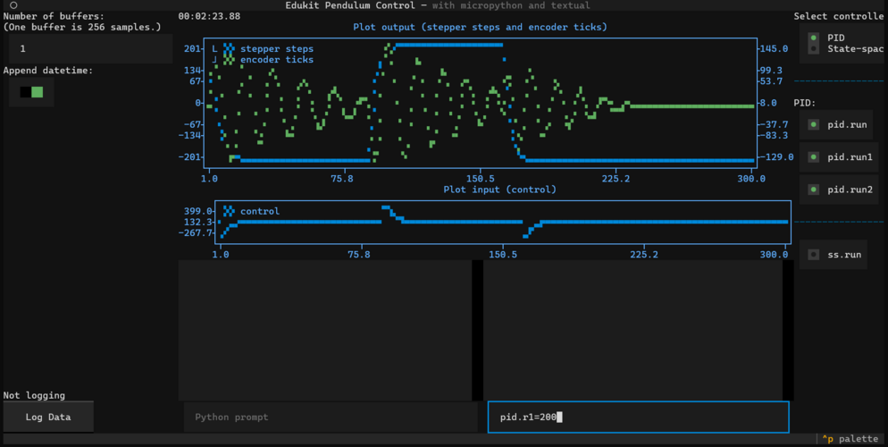

# Micropython Edukit Pendulum for Dynamic Control



Control framework for the [Edukit Rotary Inverted Pendulum Control System](https://sites.google.com/view/ucla-st-motor-control/home) developed by ST Microsystems and UCLA. The micropython code is written for the STMicrosystem [Nucleo-F401RE](https://www.st.com/en/evaluation-tools/nucleo-f401re.html) and the [X-Nucleo IHM01A1](https://www.st.com/en/ecosystems/x-nucleo-ihm01a1.html) stepper motor board based on the [L6474](https://www.st.com/en/motor-drivers/l6474.html) stepper motor driver, that comes with the [STEVAL-EDUKIT](https://www.st.com/en/evaluation-tools/steval-edukit01.html), but can be adapted for other hardware as well.

## User Interface Options

This project provides **two user interface options**:

### 1. Textual (Terminal UI) - `textual_mpy_edukit.py`
- Terminal-based interface using [Textual](https://textual.textualize.io/)
- Runs directly in your terminal/command prompt
- Lightweight and fast
- Best for: SSH sessions, remote access, low-resource systems

### 2. NiceGUI (Web Interface) - `nicegui_mpy_edukit.py` ⭐ **NEW**
- Modern web-based interface using [NiceGUI](https://nicegui.io/)
- Access from any web browser (http://localhost:8080)
- Interactive Plotly charts with zoom/pan
- Clean, responsive design
- Single-user mode for hardware safety
- **Best for**: Students, presentations, ease of use

**Both interfaces provide the same functionality:**
- ✅ Real-time plotting (stepper steps, encoder ticks, control signal)
- ✅ Dual REPL consoles (Python + MicroPython)
- ✅ PID and State-space controller selection
- ✅ Data logging to CSV/pickle files
- ✅ Manual controls and parameter adjustment

**Running the interfaces:**
```bash
# Terminal UI (Textual)
python textual_mpy_edukit.py

# Web UI (NiceGUI) - then open http://localhost:8080 in your browser
python nicegui_mpy_edukit.py
```

---

## Installation

### Quick Start (Automated Setup)

For a fast, automated setup, use the provided scripts:

**Windows:**
```bash
# 1. Clone or download the repository in terminal:
git clone https://github.com/prfraanje/edukit-micropython
cd edukit-micropython

# 2. Run the setup script (double-click setup.bat or run in terminal)
setup.bat

# 3. After setup completes, activate venv and run the app
venv\Scripts\activate

# Run either interface:
python textual_mpy_edukit.py  # Terminal UI
# OR
python nicegui_mpy_edukit.py  # Web UI (open http://localhost:8080)
```

Or use the convenience script:
```bash
run.bat
```

**Linux/Mac:**
```bash
# 1. Clone or download the repository
git clone https://github.com/prfraanje/edukit-micropython
cd edukit-micropython

# 2. Run the setup script
./setup.sh

# 3. After setup completes, activate venv and run the app
source venv/bin/activate

# Run either interface:
python textual_mpy_edukit.py  # Terminal UI
# OR
python nicegui_mpy_edukit.py  # Web UI (open http://localhost:8080)
```

Or use the convenience script:
```bash
./run.sh
```

> **Note:** This script does not flash Micropython nor copy the python files to the microcontroller (see steps 6-8 in the detailed instructions below; at the MBRTC pratical these steps has been done, and do not need to be repeated).

---

### Prerequisites
- **Python 3.12 or 3.13** installed on your PC
- **Git** (optional, but recommended for easy updates)
- **ST-Link USB Driver** (Windows only - see step 5 below)

### Detailed Step-by-Step Installation

> **Note:** If the Quick Start succeeded, these steps are not needed, and you can continue at [Usage](#usage).
> **Note:** Rather than installing python manually and using `pip`, one may prefer to use the faster and more powerful utility `uv`, see [uv](https://docs.astral.sh/uv/).

#### 1. Download the Code

**Option A: Using Git (Recommended)**

Open a terminal (Windows: Press `Win+R`, type `cmd`, press Enter; Ubuntu: Press `Ctrl+Alt+T`) and run:
```bash
git clone https://github.com/prfraanje/edukit-micropython
cd edukit-micropython
```
With Git, you can easily update to the latest version later with:
```bash
git pull
```

**Option B: Download ZIP**

Download the ZIP file from the green `<> Code` button on GitHub, extract it, and navigate to the folder in your terminal:
```bash
cd edukit-micropython
```

#### 2. Install Python

**Windows:**
1. Download Python from [python.org](https://www.python.org/downloads/)
2. Run the installer and **CHECK** "Add Python to PATH"
3. Verify installation by opening a new terminal and running:
   ```bash
   python --version
   ```
   You should see `Python 3.12.x` or `Python 3.13.x`

**Linux/Mac:**

Python is usually pre-installed. Verify with:
```bash
python3 --version
```

If not installed, use your package manager:
```bash
# Ubuntu/Debian
sudo apt install python3 python3-venv python3-pip

# Mac (using Homebrew)
brew install python3
```

#### 3. Create a Virtual Environment

**Virtual environments isolate project dependencies and prevent conflicts with other Python projects.**

**Windows:**
```bash
python -m venv venv
venv\Scripts\activate
```

**Linux/Mac:**
```bash
python3 -m venv venv
source venv/bin/activate
```

You should now see `(venv)` at the start of your terminal prompt, indicating the virtual environment is active.

> **Note:** You need to activate the virtual environment every time you open a new terminal. Run the activation command again if you don't see `(venv)` in your prompt.

#### 4. Install Python Dependencies

With the virtual environment activated, install all required packages:
```bash
pip install -r requirements.txt
```

This installs Textual (the UI framework), aioserial (for microcontroller communication), and all other necessary packages.

#### 5. Install ST-Link USB Driver (Windows Only)

Download and install the [STSW-LINK009](https://www.st.com/en/development-tools/stsw-link009.html) ST-LINK USB driver from ST Microsystems. This is required for Windows to communicate with the Nucleo board.

#### 6. Flash MicroPython to the Microcontroller (at the MBRTC practical this step has been done)

1. Download MicroPython v1.24.0 firmware for [Nucleo-F401RE](https://micropython.org/download/NUCLEO_F401RE/)
2. Connect your Nucleo-F401RE board to your PC via USB
3. A USB drive should appear (usually named `NODE_F401RE`)
4. Copy the downloaded `.hex` file to this USB drive
5. The board will automatically flash and reboot

**Alternative:** Use [Thonny IDE](https://thonny.org) which provides a user-friendly interface for flashing MicroPython.

#### 7. Compile MicroPython Files (Optional but Recommended)

Compiled `.mpy` files are smaller and load faster than `.py` files.

First, install the mpy-cross compiler (make sure your virtual environment is active):
```bash
pip install mpy-cross==1.24.0
```

**Windows:**
```bash
mpy-cross -march=armv7emsp -O3 -X emit=bytecode mpy_edukit.py
mpy-cross -march=armv7emsp -O3 -X emit=bytecode ucontrol.py
mpy-cross -march=armv7emsp -O3 -X emit=bytecode uencoder.py
mpy-cross -march=armv7emsp -O3 -X emit=bytecode uL6474.py
mpy-cross -march=armv7emsp -O3 -X emit=bytecode urepl.py
```

**Linux/Mac:**
```bash
make
```

#### 8. Copy Files to the Microcontroller (at the MBRTC practical this step has been done)

**Windows (Using Thonny - Recommended):**
1. Open [Thonny](https://thonny.org)
2. Go to `Run` → `Select Interpreter` → Choose `MicroPython (generic)`
3. Select the correct COM port
4. Use the file browser to upload these files to the microcontroller's `/flash` folder:
   - `uL6474.mpy` (or `uL6474.py` if not compiled)
   - `uencoder.mpy` (or `uencoder.py`)
   - `ucontrol.mpy` (or `ucontrol.py`)
   - `urepl.mpy` (or `urepl.py`)
   - `mpy_edukit.mpy` (or `mpy_edukit.py`)
5. **Important:** Delete `boot.py` and `main.py` if they exist on the microcontroller

**Linux/Mac:**
```bash
make deploy
make erase_default
```

#### 9. Run the Application

Make sure your virtual environment is activated (you should see `(venv)` in your prompt), then run:
```bash
python textual_mpy_edukit.py
```

You should see the Textual UI appear!

> **Windows Note:** If you see garbled characters, run `chcp 65001` in your terminal before starting the application to enable UTF-8 encoding.

---

### Troubleshooting

**"python: command not found" (Windows):**
- Try using `py` instead of `python`
- Make sure you checked "Add Python to PATH" during installation
- Restart your terminal after installing Python

**Virtual environment won't activate:**
- Make sure you're in the `edukit-micropython` folder
- On Windows, you may need to enable script execution: `Set-ExecutionPolicy -ExecutionPolicy RemoteSigned -Scope CurrentUser`

**Can't find the microcontroller:**
- Make sure the USB cable is connected
- Try a different USB port
- Check Device Manager (Windows) or `ls /dev/ttyACM*` (Linux) to verify the device is detected

**Dependencies fail to install:**
- Update pip: `python -m pip install --upgrade pip`
- Make sure your virtual environment is activated
- On Linux, you may need to install system packages: `sudo apt install python3-dev`

---

## Usage
1. If everything is fine, you should see the screen similar as the picture above, and repeated here:

You may need to increase your terminal size. Since  [Textual](https://textual.textualize.io/) makes use of Unicode (UTF-8) characters on Windows 10 and older versions not all characters are displayed correctly. One may try to evaluate the command `chcp 65001` in the terminal before running `python textual_mpy_edukit.py`, or just live with the imperfection.

The following figure gives the architecture of the complete system:

The following block diagram of the PID controller is given below (c.f. `ucontrol.py`):

All these pictures may be convenient to better understand the following explanation.

2. In the center of the user interface  you see two plot windows. The upper one shows the sensors: 
   * the steps of the stepper motor in blue, that is retrieved in micropython by evaluating `stepper.get_abs_pos_efficient()`
   * the ticks of the encoder in green, that is retrieved in micropython  by `encoder.value()`.
  
   The lower plot shows the control value, which is proportional to the frequency of the pulses send to the stepper motor by the L6474 stepper driver. In micropython this is the variable `pid.u` for the PID controller or `ss.u` for the state-space controller, and is send to the L6474 stepper motor driver by evaluating e.g. `stepper.set_period_direction(pid.u)` (for PID).

   The samples are all stored in `pid.sample` or `ss.sample`, and retrieved at a frequency of 20 Hz in the function `update_plots` in the class `TimeDisplay` in `textual_mpy_edukit.py` (also c.f. the attribute `self.update_timer = self.set_interval(1 / 20, self.update_time`), with the statement
   ``` 
   resp = await serial_eval(micropython_serial_interface,'pid.sample')
   ```
   In fact all (serial) communication between the PC and the microcontroller is handled by this function `serial_eval` in `textual_mpy_edukit.py`.

3. Below the plots there is a left and a right field: the left field contains a python prompt (bottom) and above a region that shows the output of the python interpreter. The right field is similar, but commands at the prompt are send to the microcontroller and the response is printed again above. So at the micropython prompt, e.g. one can type
   ``` 
   pid.sample
   ```
   to see the current value of respectively the stepper steps, encoder ticks and the control value. You may also inspect the other attributes of the object `pid` with
   ```
   dir(pid)
   ```
   And, note that you may get the stepper motor steps and encoder ticks by typing the following lines in the micropython prompts (`stepper` is an instance of the `L6474` class, `encoder` is an instance of the `Encoder` class):
   ```
   stepper.get_abs_pos_efficient()
   encoder.value()
   ```
   or send a control value, e.g. 100, to the stepper motor:
   ```
   stepper.set_period_direction(100)
   ```
   Don't forget to set it to zero to prevent the wires get twisted too much:
   ```
   stepper.set_period_direction(0)
   ```
   Also the PID controller gains can be returned, for the feedback from the stepper steps:
   ``` 
   pid.Kp1
   pid.Ki1
   pid.Kd1
   ```
   and for PID controller feeding back the encoder ticks
   ``` 
   pid.Kp2
   pid.Ki2
   pid.Kd2
   ```
4. At the micropython prompt one can also set these parameters, e.g. by
   ```
   pid.Kp1 = 1
   ```
5. For quicker getting and setting the PID controller gains, one can use these the following get- and set-functions as well:
   ``` 
   pid.get_gains1()
   pid.get_gains2()
   pid.set_gains1(0.1,0.0001,0.001)
   pid.set_gains2(0.1,0.0001,0.001)
   ```
   Note, that you can do
   ```
   Kp1, Ki1, Kd1 = pid.get_gains1()
   ```
   However, the variables `Kp1`, `Ki1` and `Kd1` on the left hand will be in Micropython no the microcontroller. If you want to have the values at the python prompt, you can use the `micropython_results` variable in python. For example, run at the micropython prompt (right prompt):
   ```
   pid.get_gains1()
   ```
   and than on the python prompt (left prompt), you can do:
   ```
   Kp1, Ki1, Kd1 = micropython_results[0]
   ```
   The indexing with `[0]` refers to the last micropython output, `[1]` refers to the one before, etc.
6. The reference (setpoint) value for the feedback from the stepper motor is stored in
   ```
   pid.r1
   ```
   and for the feedback from the encoder ticks, the reference is
   ``` 
   pid.r2
   ```
   So if one wants to move the stepper-motor to an angle corresponding with step value 100, one sets (besides the gains of the controller and the run-flags, see shortly below):
   ```
   pid.r1 = 100
   ```
7. Note that the prompts only allow single line input.
8. The results returned by python as well as micropython are stored in python (left field) in the variables `python_results` and `micropython_results`, so they can be accessed later when needed.
9. The vertical bar on the right contains a number of settings (radiobuttons) that are directly connected to variables on the microcontroller, e.g. to switch between PID and state-space control, to turn on/off the PID controller (`pid.run`), and to turn off/on the PID controller for the stepper motor (`pid.run1`) and the encoder (`pid.run2`).
10. The vertical bar on the left is for logging. Logging is done with two buffers on the microcontroller, that are subsequently filled. If one buffer is full it is send from the microcontroller to the PC over the serial interface, while the other buffer is being filled, and so on. The logging is at the same sampling rate as the controller (100 Hz), but at the moment a buffer is send over the serial interface, the controller may lag a bit. This is visible in the logged signal as non-fluent changes between the buffers. Reducing the sampling rate or replacing the STM F401RE microcontroller with a faster one, preferably with more processing cores, or moving the control task to a ISR (interrupt service routine) may solve this issue. For now we accept the small lags.
11. If you want to exit, close the user interface with `Ctrl-c`, which will nicely end the program on the microcontroller and the user-interface.


## Dependencies
- [Micropython](https://micropython.org) [firmware for Nucleo-F401RE](https://micropython.org/download/NUCLEO_F401RE/) and [mpy-cross](https://gitlab.com/alelec/mpy_cross) tool, tested with version 1.24.0, both should have same version!
- [Python](https://www.python.org), tested with version 3.12 and 3.13
- [Textual](https://textual.textualize.io/), tested with version 0.85.1
- [aioserial](https://pypi.org/project/aioserial/), tested with version 1.3.1 (needed for nonblocking asynchronous communication with the serial interface at the python side)
- [mpremote](https://docs.micropython.org/en/latest/reference/mpremote.html), tested with verion 1.24.0
- Further: see `requirements.txt`

## Compile the `mpy`-files
- To compile the `mpy`-files one needs the `mpy-cross` program, that you can install on both Windows and Linux, e.g. by 
  ```
  pip install mpy-cross==1.24.0
  ```
  Make sure, you give the same version as the version of micropython on the microcontroller.
- On Linux: Adjust the `Makefile` according to the location of the `mpy-cross` executable
- On Linux: Compile the micropython files with
  ```
  make
  ```
- On Windows: Evaluate 
  ```
  mpy-cross -march=armv7emsp -O3 -X emit=bytecode mpy_edukit.py
  mpy-cross -march=armv7emsp -O3 -X emit=bytecode ucontrol.py
  mpy-cross -march=armv7emsp -O3 -X emit=bytecode uencoder.py
  mpy-cross -march=armv7emsp -O3 -X emit=bytecode uL6474.py
  mpy-cross -march=armv7emsp -O3 -X emit=bytecode urepl.py
  ```

